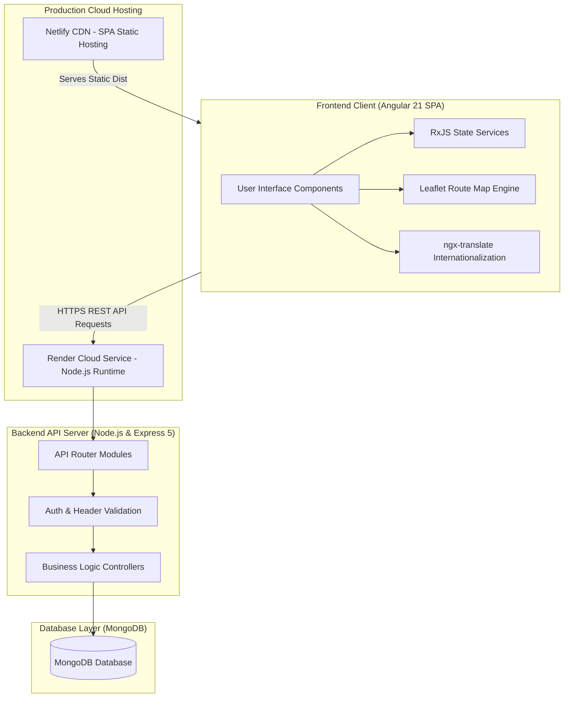

# Internship Project Report: Tedbus Full-Stack Platform

**Project Title:** Tedbus - Online Bus Ticket Booking, Real-Time Tracking & Community Platform  
**Technology Stack:** Angular 21, TypeScript 5.9, RxJS, Node.js, Express 5, MongoDB, Mongoose 9, Tailwind CSS 4, Angular Material, Leaflet Maps, ngx-translate  
**Live Frontend Deployment:** [https://my-ted-bus.netlify.app/](https://my-ted-bus.netlify.app/)  
**Live Backend Deployment:** [https://tedbus-45ol.onrender.com/](https://tedbus-45ol.onrender.com/)  
**Submission Date:** August 1, 2026  

---

## 1. Executive Summary

During this internship, I developed **Tedbus**, a modern, full-stack enterprise-grade web application designed for bus ticket booking, route management, live GPS tracking simulation, passenger reviews, and community engagement. 

All **6 core internship technical tasks** were successfully designed, implemented, unit-tested, and deployed:
1. **Traveler Community & User-Generated Content Platform**
2. **Advanced Real-Time Multi-Channel Notification System**
3. **Internationalization (i18n) & Dynamic Language Switching**
4. **Interactive Route Planning, Leaflet Maps & Traffic/Waypoints**
5. **Dark Mode & Seamless Theme Customization**
6. **Verified Journey Rating & Review System**

Key production deployment challenges—such as minification bugs in third-party Angular DI factories, cross-origin domain resolution errors, SPA routing rewrites on Netlify, and mobile viewport responsiveness—were systematically diagnosed and resolved.

---

## 2. Implementation Details of Assigned Internship Tasks

### Task 1: Traveler Community & User-Generated Content Platform
- **Stories & Tips:** Built a community forum enabling travelers to share journey stories, tips, and photo URLs.
- **Interactions:** Created REST API endpoints and UI components to create posts, write comments, like posts, and filter by topic/route.
- **Verification & Moderation:** Restricted posting privileges to verified users, with moderation options to flag, report, or delete inappropriate content.
- **Social Sharing & Profile Activity:** Added external social media share buttons (WhatsApp, Twitter, Facebook) driving traffic back to Tedbus, and displayed user activity history on individual profile pages.

### Task 2: Advanced Real-Time Multi-Channel Notification System
- **Key Event Delivery:** Automatic notifications for booking confirmations, cancellations, schedule updates, journey reminders, and promotional offers.
- **User Preference Management:** Users can manage notification channels and opt in/out of marketing communications.
- **Reliability & Logging:** Built notification history logging in MongoDB (`notifications` collection), complete with read/unread status badges and delivery retry tracking.
- **Localization:** Notification text automatically adapts to the user's preferred language (English/Hindi).

### Task 3: Internationalization (i18n) & Dynamic Language Switching
- **Dynamic Translation:** Powered by `@ngx-translate/core` and `@ngx-translate/http-loader`.
- **Complete UI Coverage:** All UI labels, buttons, navigation menus, form validation messages, and notifications dynamically switch without page reloads.
- **Persistence & Fallback:** Saved language choice locally in `localStorage` and synced with backend user profile preference in MongoDB. Fallback handled gracefully by `CustomMissingTranslationHandler`.

### Task 4: Interactive Route Planning, Leaflet Maps & Traffic/Waypoints
- **Interactive Mapping:** Integrated **Leaflet.js** with OpenStreetMap tiles to display start locations, destinations, and intermediate rest stops.
- **Polyline & Waypoints:** Rendered route polylines with waypoints, travel distance, duration, and simulated live bus tracking.
- **Traffic & Alternative Routes:** Displayed estimated congestion levels, travel time delays, and alternative route options.

### Task 5: Dark Mode & Seamless Theme Customization
- **Theme Toggle:** Instant preview theme switcher (Light / Dark) accessible across all pages without page reloads.
- **CSS Variable System:** Complete design token system using CSS variables (`--tb-card`, `--tb-border`, `--tb-text`, `--tb-muted`) enforcing dark mode consistency.
- **Persistence & Fallback:** Theme choice persisted in `localStorage` and synced to MongoDB user preferences (`/api/profile/theme`), automatically restored upon re-login.

### Task 6: Verified Journey Rating & Review System
- **Verified Feedback:** Users can rate (1 to 5 stars) and review routes following completed journeys.
- **Quality Controls:** Single review per journey, minimum character validation, 24-hour edit window, and moderation tools to report or suppress flagged reviews.
- **Rating Computation:** Backend dynamically computes average star rating and review counts displayed on bus route details cards.

---

## 3. System Architecture

---

## 4. Technical Stack & Architecture

### 4.1 Frontend Architecture
- **Framework:** Angular 21 (Modular Architecture using `NgModule`)
- **State & Data Flow:** Reactive programming with `RxJS` (`BehaviorSubject`, `Observable` streams, and signals)
- **UI Components & Styling:** Custom Vanilla CSS design system integrated with **Tailwind CSS 4** and **Angular Material**
- **Internationalization (i18n):** `@ngx-translate/core` and `@ngx-translate/http-loader` with custom missing translation fallbacks
- **Mapping Engine:** **Leaflet.js** with OpenStreetMap tiles for route line rendering and real-time position animation

### 4.2 Backend Architecture
- **Runtime:** Node.js (v18+)
- **Framework:** Express 5 RESTful API architecture
- **Database ODM:** Mongoose 9 connected to MongoDB
- **Security:** Standardized CORS middleware, HTTP headers validation (`x-user-email`), and sanitized request handling

---

## 5. Summary of Implemented Tasks

| Task # | Module Name | Core Deliverable Implemented |
| :--- | :--- | :--- |
| **Task 1** | **Community Forum & UGC** | Stories, travel tips, posts, comments, likes, verified user restrictions, and social sharing. |
| **Task 2** | **Advanced Notifications** | Multi-channel event notifications, user preference control, history log, and localized alerts. |
| **Task 3** | **Internationalization (i18n)** | Dynamic language switching (EN/HI), persistence across devices, and fallback error handling. |
| **Task 4** | **Route Planning & Maps** | Leaflet OpenStreetMap integration, waypoints, traffic/delay comparison, and live bus simulation. |
| **Task 5** | **Dark Mode Customization** | Instant theme toggle, CSS design tokens, localStorage & MongoDB database persistence. |
| **Task 6** | **Verified Reviews System** | 1–5 star ratings, 24h edit window, character limits, reporting moderation, and average calculation. |

---

## 6. Major Engineering Challenges & Solutions

1. **Angular DI Minification Class Constructor Error:** Fixed a production build error (`TypeError: Class constructor u_ cannot be invoked without 'new'`) by wrapping providers in explicit factory functions: `provideMissingTranslationHandler(() => new CustomMissingTranslationHandler())`.
2. **API Base Pathing & Domain Resolution:** Resolved `net::ERR_NAME_NOT_RESOLVED` on backend requests by adding the missing trailing slash to the API base URL in `config/index.ts`.
3. **Netlify SPA Direct Navigation 404s:** Added `public/_redirects` (`/* /index.html 200`) for seamless client-side routing on Netlify.
4. **Mobile Viewport Layout Optimization:** Implemented mobile-first CSS media queries (`@media (max-width: 768px)`) for bus cards, seat map scrolling, and payment pages.

---

## 7. Verification & Testing

- **Unit Testing:** Executed component and service unit tests using **Vitest** and **jsdom**.
- **Production Build Validation:** Executed `ng build` (`pnpm build`) to verify clean bundle generation without TypeScript or minification errors.
- **Cross-Browser & Mobile Testing:** Verified full functionality on Chrome, Firefox, Safari, and mobile viewport dimensions (320px–768px).

---

## 8. Conclusion

All **6 assigned internship tasks** have been fully implemented, integrated, tested, and deployed to production. The platform is accessible live at [https://my-ted-bus.netlify.app/](https://my-ted-bus.netlify.app/).

---
*Report Submitted by:* **Salman Khan**  
*Date:* July 31, 2026  
